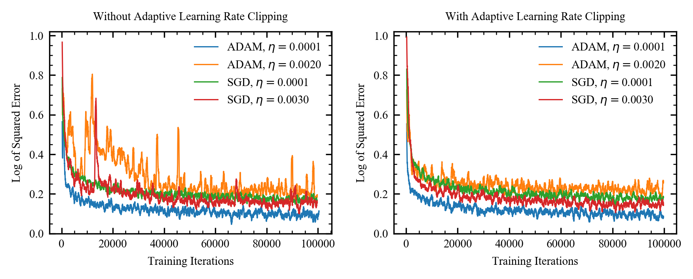

# Adaptive Learning Rate Clipping (ALRC)

[](https://doi.org/10.5281/zenodo.3686987)

Repository for the [preprint](https://arxiv.org/abs/1906.09060)|paper "Adatpive Learning Rate Clipping Stabilizes Learning". 

This repository contains source code for CIFAR-10 supersampling experiments with squared and quartic errors. An implementation of the ALRC algorithm is in `alrc.py`. Source code for partial-STEM is [here](https://github.com/Jeffrey-Ede/partial-STEM).

<p align="center">
  
</p>

Example learning curves for stable and unstably high learning rates. ALRC stabilizes learning by preventing loss spikes and otherwise has little effect. Learning curves are 500 iteration boxcar averaged. Results are similar for low and high-order loss functions, different batch sizes and different optimizers. 


# Description

ALRC is a simple, computationally inexpensive algorithm that stabilizes learning by limiting loss spikes. It can be applied to any neural network trained with gradient descent. In practice, it improves the training of neural networks where learning is destabilized by loss spikes and otherwise has little effect.

# Example

ALRC can be applied like any other neural network layer and is robust to hyperparamer choices. The only hyperparameters that need to be provided are estimates for the mean and mean squared loss function at the start of training. Any sensible overestimates are fine: even if they are an order of magnitude too high, the ALRC algorithm will decay them to the correct values.

```python
#Roughly estimate the first two raw moments of your loss function
mu1_start_estimate = ... #Your estimate
mu2_start_estimate = ... #Your estimate

#It's fine to overestimate
overestimate_factor = 3 
mu1_start_estimate *= overestimate_factor
mu2_start_estimate *= overestimate_factor**2

loss = my_loss_fn( ... ) #Apply neural network and infer loss
loss = alrc(loss, mu1_start=mu1_start_estimate, mu2_start=mu2_start_estimate) #Apply ALRC
```

Note that `mu2_start` should be larger than `mu1_start**2`.

# When Should I Use ALRC?

If learning is destabilized by high loss spikes. This is common for training with small batch sizes, unstably high learning rates or high order loss functions. It might also help if your dataset contains unusual or mislabelled examples that cause loss spikes.

ALRC can also be used to safeguard against potential loss spikes. Anecdoteally, this was the situation in our [partial STEM](https://arxiv.org/abs/1905.13667) experiments. Large loss spikes would sometimes occur partway through training, which made results difficult to compare. ALRC prevented loss spikes, making training more consistent so that different experiments could be compared.
